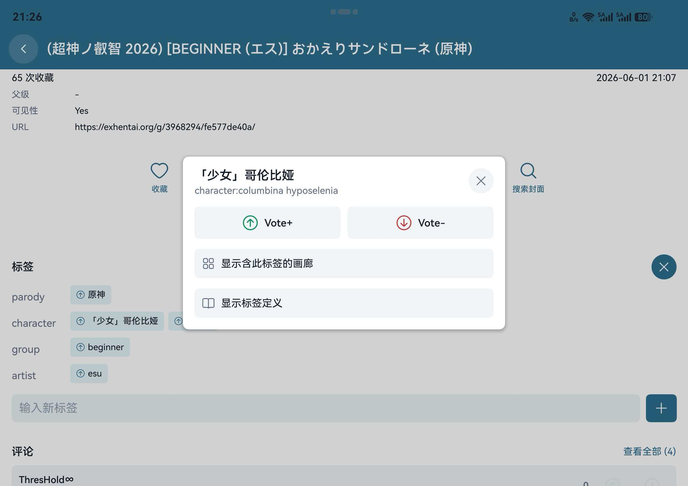

# EhViewer HarmonyOS

  

这是 [Ehviewer_CN_SXJ](https://github.com/xiaojieonly/Ehviewer_CN_SXJ) 的 HarmonyOS 移植版本，面向手机、平板、折叠屏和电脑提供画廊浏览、搜索、阅读、下载、翻译与数据迁移功能。

## 下载与安装

请在 [GitHub Releases](https://github.com/suibianqwe/Ehviewer_OHOS/releases) 下载最新的未签名 HAP，可使用 [小白调试助手](https://github.com/likuai2010/auto-installer) 安装。

- 当前版本：`0.5.6`
- 安装包：[`EhViewer_OHOS_0.5.6.hap`](https://github.com/suibianqwe/Ehviewer_OHOS/releases/download/v0.5.6/EhViewer_OHOS_0.5.6.hap)
- 目标 API：`26.0.0`
- 兼容 API：`6.0.0(20)`

API 20 起可安装；低于 API 23 的设备会自动跳过不兼容的 SNI 域名前置增强。

## 使用教程

初次使用、登录、搜索、分栏、阅读器、漫画翻译、下载恢复、网络设置和数据迁移等操作，请查看：

### [EhViewer HarmonyOS 完整使用教程](docs/USER_GUIDE.md)

教程包含目录、分章节步骤、真实界面截图、常见问题和日志导出说明。

## 功能特色

- 浏览：支持 E-Hentai/ExHentai、主页、订阅、热门、排行、云端收藏、本地收藏、历史和下载列表。
- 搜索：支持关键词、多标签、上传者、高级筛选、搜索书签、搜索历史、相似图片和封面搜索。
- 详情：支持收藏、评分、系统分享、Torrent 磁力链接、存档、H@H、评论、预览图、相似画廊、标签编辑和投票。
- 阅读：支持左右/连续阅读、缩放、方向适配、自适应一屏双页、预加载、本地优先和独立全屏阅读器。
- 翻译：支持列表标题、详情标题、评论及漫画 OCR 翻译，可选网页翻译、DeepSeek、OpenAI、Gemini 和自定义兼容 API。
- 下载：支持统一优先级并行调度、通知进度与速度、隐私通知、状态筛选、多选管理、恢复下载项和 ZIP 导入/导出。
- 宽屏：支持可拖动分割线的左右分栏，列表、详情和设置页面保持独立路由与焦点返回逻辑。
- 迁移：支持 JSON/安卓数据库导入、原 EhViewer 下载目录恢复，以及包含图片文件和评论黑名单的 Wi-Fi 直连传输。
- 个性化：支持简体中文、繁体中文、明暗主题、多种主题色、标签翻译、过滤规则、评论黑名单和隐私保护。
- 网络：支持系统/HTTP/SOCKS5 代理、DoH、内置 Hosts、SNI 域名前置、直连检测和网络诊断。

## 界面预览

<table>
  <tr>
    <td></td>
    <td></td>
    <td></td>
    <td></td>
  </tr>
  <tr>
    <td align="center">黑色主题</td>
    <td align="center">画廊列表</td>
    <td align="center">高级搜索</td>
    <td align="center">详情操作</td>
  </tr>
  <tr>
    <td></td>
    <td></td>
    <td></td>
    <td></td>
  </tr>
  <tr>
    <td align="center">多标签搜索</td>
    <td align="center">阅读器设置</td>
    <td align="center">标签编辑与投票</td>
    <td align="center">宽屏分栏</td>
  </tr>
</table>

## 数据迁移

从原安卓 EhViewer 迁移时，可将原下载画廊目录复制到鸿蒙设备的 EhViewer 下载目录，再运行 `设置 → 下载 → 恢复下载项`。应用也能识别公共 Download 根目录中的未加密存档、应用导出包和外来画廊 ZIP。

详细步骤与路径说明见[完整教程的迁移章节](docs/USER_GUIDE.md#14-从原-ehviewer-迁移下载数据)。

## 反馈

欢迎通过 [Issues](https://github.com/suibianqwe/Ehviewer_OHOS/issues) 反馈问题。请尽量提供应用版本、设备与系统版本、复现步骤、截图/录屏和已脱敏日志。漫画翻译问题建议同时导出 OCR 调试信息。

## 致谢

感谢 [Ehviewer_CN_SXJ](https://github.com/xiaojieonly/Ehviewer_CN_SXJ) 和 [EhViewer](https://github.com/seven332/EhViewer) 项目的作者与贡献者。

感谢 [EhTagTranslation/Database](https://github.com/EhTagTranslation/Database) 项目维护中文标签翻译数据。

## 许可

本项目继承原应用许可证，详见 [LICENSE](LICENSE)。
